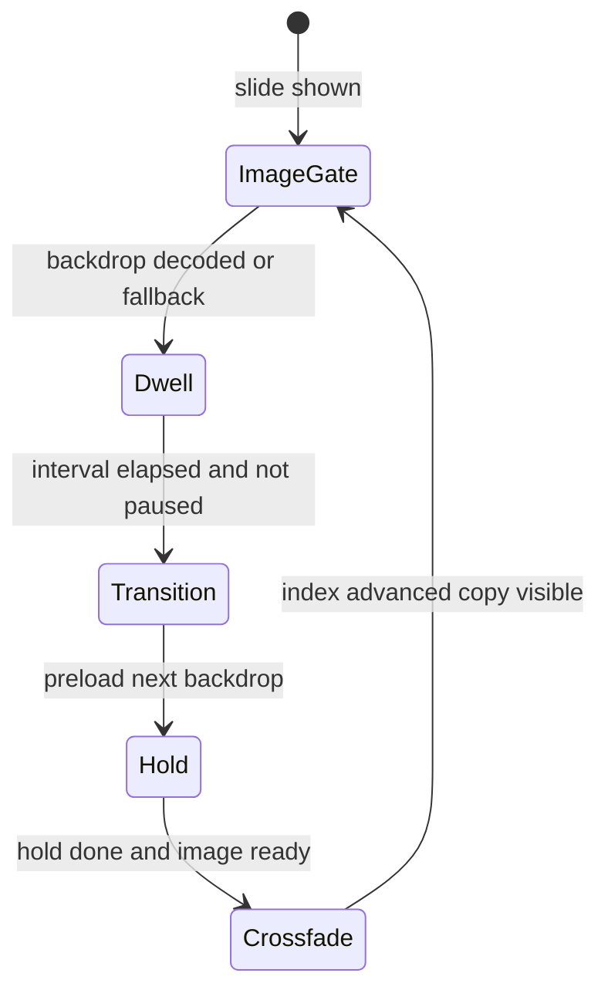

# Homepage hero (billboard)

Design contract for `app-homepage-hero`. **Read this before changing** `src/app/homepage-hero/**`, `hero-slides.ts`, or homepage CSS that affects billboard copy height / scroll.

Curation storage / KV API: [flix-prototype.md](./flix-prototype.md) — **out of scope** here.

## Purpose

Full-bleed featured-episode carousel: backdrop crossfade, Ken Burns (desktop), dwell auto-advance, curator controls, pager dashes, touch swipe (mobile).

## Design tensions (read first)

These goals fight each other. **All are required.** Fixes that only optimize one side regress the others.

| Goal | Why | Wrong “fix” |
|------|-----|----------------|
| **Stable height when description exists** (HERO-SCR-002) | Short vs long descriptions (1–3 lines) must not collapse the panel mid-autoplay | Always reserve 3 lines of desc height on every slide |
| **No blank band when description is absent** (HERO-SCR-004) | Clips / short episodes often have **empty** `episodeDescription` — mobile shows a large black gap between meta and Watch | Empty `<p class="billboard__desc">` with `min-height`, or unconditional `min-height` on `.billboard__copy-body` |
| **No blank band under short titles** (HERO-SCR-005) | Stacked layout (≤1280) puts the title in normal flow; a 1-line title with a 3-line `min-height` leaves a large gap above the date/meta | `.billboard__title { min-height: calc(1.12em * 3) }` (or similar) on stacked layouts |

**Correct pattern**

1. Render `.billboard__desc` **only** when `hasFeaturedDesc` (trimmed text length > 0).
2. Render `.billboard__copy-body` **only** when there is a description **or** at least one public subject (`hasCopyBody`).
3. Apply reserved desc min-height **only** under `.billboard__copy-body.has-desc` (and `.billboard__desc` itself).
4. Title: `line-clamp: 3` as a **ceiling** only — **never** set title `min-height` to N lines. Accept 1–3 line height variance; keep `overflow-anchor: none` (HERO-SCR-001 / 003).
5. Keep `overflow-anchor: none` on `.billboard` when slides flip between short/long title or has-desc / no-desc.

**How to notice in review / QA**

- **HERO-SCR-004:** slide with no description and no subjects — meta should sit close above Watch (no multi-line empty band).
- **HERO-SCR-005:** slide with a short title (e.g. “The Rulo Farm”) on mobile/stacked — date/meta should sit close under the title, not after ~2 empty title lines.
- Automated: specs tagged `HERO-SCR-004` / `HERO-SCR-005` (DOM + Sass forbids title line-reservation `min-height`).

If you “fix scroll jump” by re-adding unconditional copy-body `min-height` or title `min-height: calc(1.12em * 3)`, you will recreate the mobile blank-space bugs.

## Key files

| Path | Role |
|------|------|
| `src/app/homepage-hero/homepage-hero.component.{ts,html,sass}` | Billboard UI, transitions, swipe, layout |
| `src/app/homepage-hero/homepage-hero.component.spec.ts` | Behaviour + CSS-contract regressions |
| `src/app/hero-slides.ts` | Build / prune curated week slides |
| `src/app/hero-curation.service.ts` | Client for `/hero-curation` |
| `src/app/hero-manage-dialog/*` | Curator reorder / remove |
| `src/app/homepage-api/homepage-api.component.ts` | Supplies `slides`, curation wiring |

## Requirements (stable IDs)

Use these IDs in PR notes and test descriptions.

| ID | Requirement | Automated? |
|----|-------------|------------|
| **HERO-SUB-001** | Every public subject (not `_`-prefixed) renders as a chip; no count/row cap in TS, template, or CSS | Yes |
| **HERO-SUB-002** | Watch/Listen + More info stay **below** the subject chip block | Yes (DOM order) |
| **HERO-SCR-001** | `.billboard` (and dots viewport) set `overflow-anchor: none` | Yes (Sass contract) |
| **HERO-SCR-002** | When a description exists: title/desc are 3-line clamped; `.billboard__desc` and `.billboard__copy-body.has-desc` reserve min-height so **short** copy does not collapse the panel | Yes (Sass contract) |
| **HERO-SCR-003** | Changing slide while the page is scrolled must not yank `window.scrollY` | Manual |
| **HERO-SCR-004** | No description: omit empty desc; omit copy-body when no desc and no subjects; **never** reserve desc `min-height` without `.has-desc` — mobile must not show a blank band above Watch | Yes |
| **HERO-SCR-005** | Short titles must not reserve empty lines: stacked layout must **not** set `.billboard__title { min-height: N lines }` — meta follows the title tightly | Yes (Sass contract) |
| **HERO-CTL-001** | Stage / grain / scrim / vignette use `pointer-events: none` so pager stays clickable | Yes (Sass contract) |
| **HERO-CTL-002** | Touch swipe ignores links, buttons, pager, admin, actions | Yes |
| **HERO-CTL-003** | Hover pause only while the pointer is over the art hit-target (`.billboard__art-hover`) or pager/admin — **not** while over title/description/copy | Yes |
| **HERO-CTL-004** | Stacked medium layout (≤1280 and ≥701): pager/admin sit over the framed art band (not in-flow below copy where they fall off-screen) | Yes (e2e + Sass) |
| **HERO-SCR-006** | Stacked medium (701–1280): feature copy + Watch/More info dock onto the art band so primary CTAs are above the fold without scrolling | Yes (e2e + Sass) |
| **HERO-SWP-001** | Touch horizontal swipe ≥48px → `prevHero` / `nextHero` (existing transition; no drag animation); mouse ignored; `touch-action: pan-y` on billboard | Yes |
| **HERO-LIF-001** | Image gate blocks dwell until decode or 12s fallback | Yes |
| **HERO-LIF-002** | `restartHeroCycle` must not clear `heroContentTimer` / in-flight preload | Yes |
| **HERO-LIF-003** | Hold + crossfade: copy stays until next backdrop ready, then leaves with image | Yes |
| **HERO-LIF-004** | Reduced motion: immediate index jump, no cycle timer | Yes |
| **HERO-LIF-005** | Save-GPU: Ken Burns off, auto-advance on | Yes |
| **HERO-LIF-006** | Quiet slide refresh (same id sequence) does not rebuild layers | Yes |
| **HERO-CUR-001** | Curator manage / remove controls emit and stay in admin toolbar | Yes |

## Slide lifecycle



Constants (`HomepageHeroComponent`):

| Constant | Value | Meaning |
|----------|-------|---------|
| `heroIntervalMs` | 7500 | Dwell before auto-advance (`--hero-interval` for Ken Burns) |
| `heroImageFallbackMs` | 12000 | Safety gate if decode never completes |
| `heroContentHoldMs` | 450 | Hold current copy before leaving |
| `heroContentOutMs` | 550 | Must match `.billboard__feature.is-hidden` duration |
| `heroTransitionMs` | 1200 | Stage opacity / outgoing Ken Burns clear |
| `swipeThresholdPx` | 48 | Touch horizontal swipe → prev/next |

## Hard layout invariants

### Subjects (HERO-SUB-*)

- `featuredSubjects` filters only `_` prefixes — **no** `.slice` / max-count.
- `.billboard__subjects`: wrapping flex; **no** `overflow: hidden`, fixed `max-height`, or line-clamp.
- Actions (`.billboard__actions`) follow subjects in the DOM.

### Scroll stability vs empty copy (HERO-SCR-*)

See **Design tensions** above. Summary:

| Mechanism | Selector / rule |
|-----------|-----------------|
| `overflow-anchor: none` | `.billboard`, `.billboard__dots-viewport` |
| Title clamp 3 (ceiling only) | `.billboard__title` — **no** `min-height` reserving empty lines |
| Desc clamp 3 + min-height | `.billboard__desc` — **only when rendered** |
| Reserved copy-body | `.billboard__copy-body.has-desc` only — **not** bare `.billboard__copy-body` |
| Empty slide | No `.billboard__desc`; no `.billboard__copy-body` if no subjects either |
| Wide absolute docking / narrow stacked band | media queries in the same Sass file |

**Forbidden regressions**

- Unconditional `min-height` on `.billboard__copy-body` (breaks HERO-SCR-004).
- Always rendering `<p class="billboard__desc">{{ featuredDesc() }}</p>` when the string is empty.
- `.billboard__title { min-height: calc(1.12em * 3) }` (or any N-line title reservation) on stacked layouts (breaks HERO-SCR-005 — short titles leave a blank band above meta).
- “Fixing” blank space by removing `.has-desc` min-height while a description **is** present (breaks HERO-SCR-002 for short text).

Unit tests assert Sass contracts + HERO-SCR-004 DOM behaviour. **HERO-SCR-003** remains a scrolled visual check.

### Controls & swipe (HERO-CTL-*, HERO-SWP-*)

- Full-bleed layers: `pointer-events: none`.
- Billboard: `touch-action: pan-y`.
- Swipe: touch/pen only; axis lock; ignore interactive targets via `isSwipeIgnoredTarget`.
- Hover pause (HERO-CTL-003): `.billboard__art-hover` + `.billboard__controls` only — not the whole `.billboard`.
- Stacked medium pager (HERO-CTL-004): absolute over `--hero-band-h` for 701–1280px (and viewport height ≥600); phone keeps controls in-flow under copy.
- Stacked medium copy (HERO-SCR-006): dock `.billboard__content` onto the art (opaque card) so Watch/More info stay above the fold; phone / short landscape keep the in-flow panel under the frame.

### Copy hierarchy

Eyebrow → podcast pill → title → meta → (optional description) → (optional subject chips) → Watch/Listen + More info.

When description and subjects are both absent, actions follow meta directly.

## Known failure modes

| Symptom | REQ | How we catch |
|---------|-----|----------------|
| Subject chips missing / clipped | HERO-SUB-001 | Spec uncapped chips + Sass forbids subjects overflow/max-height |
| Actions above / mixed into chips | HERO-SUB-002 | DOM order: subjects before actions |
| Page jumps on advance | HERO-SCR-001/003 | Sass `overflow-anchor` + manual scrolled advance |
| Huge blank gap above Watch (esp. mobile, no description) | HERO-SCR-004 | Specs omit empty desc/copy-body; Sass reserves height only under `.has-desc` |
| Huge blank gap under short title (above date/meta) | HERO-SCR-005 | Sass contract forbids title N-line `min-height` |
| Short description collapses panel / jumpy actions | HERO-SCR-002 | Sass min-height on `.has-desc` / `.billboard__desc` |
| Chevron dead | HERO-LIF-002 | Spec: next chevron does not cancel content transition |
| Dwell stuck after pager | focus pause | Spec: releases chevron focus |
| Blank / text ahead of art | HERO-LIF-001/003 | Image gate + hold-until-ready specs |
| Can’t click dashes | HERO-CTL-001 | Sass `pointer-events: none` on stages |
| Hover over title pauses carousel | HERO-CTL-003 | Spec: leave on copy does not keep pause; art hover does |
| Pager below fold on stacked desktop | HERO-CTL-004 | e2e stacked-desktop: controls intersect art band |
| Watch/More info below fold on stacked desktop | HERO-SCR-006 | e2e stacked-desktop: play button inside viewport on art |
| Scroll fights swipe | HERO-SWP-001 | `touch-action: pan-y` + swipe specs |
| Ken Burns on phone | HERO-LIF-005 | saveGpu spec |

## Layout geometry e2e (Playwright)

Unit tests cannot apply real CSS media queries / box geometry the way a phone does. Use:

```bash
npm run test:e2e:hero-layout
```

(`npx playwright install chromium` once per machine.)

| Piece | Role |
|-------|------|
| `e2e/hero-layout.spec.ts` | Viewport × fixture matrix; geometry + visibility asserts |
| `e2e/hero-layout/fixtures.ts` | Episode configs (empty desc, many subjects, short/long title) |
| `e2e/hero-layout/build-harness.ts` | Compiles **real** `homepage-hero.component.sass` (`:host` → `.hero-layout-host`) |

**Viewports:** mobile (390×844), mobile-landscape (844×390), tablet (768×1024), stacked-desktop (1100×800), wide (1440×900), **full-hd (1920×1080)**.

**Fixtures include:** no description; many subjects (12) with and without description.

Tagged to **HERO-SCR-002 / 004 / 005** and **HERO-SUB-001 / 002**. Keep fixture HTML aligned with `homepage-hero.component.html`.

## Soft guideline — style budget

Prefer compiled hero styles under ~16 kB; hard `anyComponentStyle` error budget is **17 kB** (`angular.json`). Do not sacrifice a layout invariant to shave a few hundred bytes.

## Regression checklist

**Automated**

- [ ] `ng test` filter `HomepageHeroComponent` (HERO-* unit / Sass contracts)
- [ ] `npm run test:e2e:hero-layout` (geometry: mobile / landscape / tablet / stacked / wide / full-hd × empty-desc & many-subjects)

**Manual**

- [ ] **HERO-SCR-004:** mobile / narrow — slide with empty description and no subjects: no large blank band between meta and Watch
- [ ] **HERO-SCR-005:** mobile / stacked — short title (1 line): date/meta tight under title, not after empty title lines
- [ ] **HERO-SCR-002:** slide with a 1-line description still keeps actions from jumping up relative to a 3-line description (reserved height when `.has-desc`)
- [ ] HERO-SCR-003: scroll hero partly off-screen; advance; no jump
- [ ] Long vs short title visually stable; descenders OK
- [ ] Mobile: swipe vs vertical scroll; CTAs still tappable
- [ ] Many subjects: all visible; actions still below

## Out of scope

- Hero KV / Auth0 / M2M — [flix-prototype.md](./flix-prototype.md), Api `docs/hero-curation-m2m-edge.md`
- Subject / day rails below the fold (except when they affect hero scroll)
