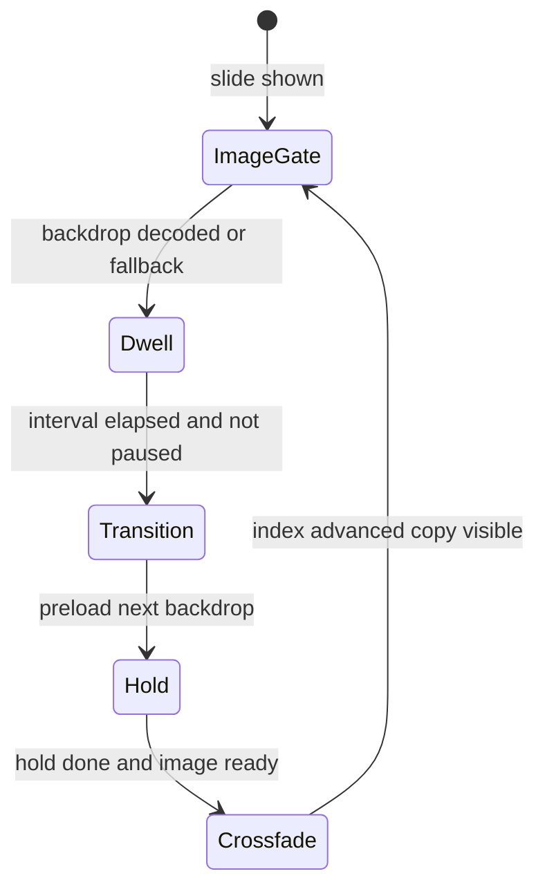

# Homepage hero (billboard)

Design contract for `app-homepage-hero`. **Read this before changing** `src/app/homepage-hero/**`, `hero-slides.ts`, or homepage CSS that affects billboard copy height / scroll.

Curation storage / KV API: [flix-prototype.md](./flix-prototype.md) — **out of scope** here.

## Purpose

Full-bleed featured-episode carousel: backdrop crossfade, Ken Burns (desktop), dwell auto-advance, curator controls, pager dashes, touch swipe (mobile).

## Key files

| Path | Role |
|------|------|
| `src/app/homepage-hero/homepage-hero.component.{ts,html,sass}` | Billboard UI, transitions, swipe, layout |
| `src/app/homepage-hero/homepage-hero.component.spec.ts` | Behaviour + CSS-contract regressions |
| `src/app/hero-slides.ts` | Build / prune curated week slides |
| `src/app/hero-curation.service.ts` | Client for `/hero-curation` |
| `src/app/hero-manage-dialog/*` | Curator reorder / remove |
| `src/app/homepage-api/homepage-api.component.ts` | Supplies `slides`, curation wiring |

## Requirements (stable IDs)

Use these IDs in PR notes and test `DisplayName`-style descriptions.

| ID | Requirement | Automated? |
|----|-------------|------------|
| **HERO-SUB-001** | Every public subject (not `_`-prefixed) renders as a chip; no count/row cap in TS, template, or CSS | Yes |
| **HERO-SUB-002** | Watch/Listen + More info stay **below** the subject chip block | Yes (DOM order) |
| **HERO-SCR-001** | `.billboard` (and dots viewport) set `overflow-anchor: none` | Yes (Sass contract) |
| **HERO-SCR-002** | Title and description are 3-line clamped; description and `.billboard__copy-body` reserve min-height so short copy does not collapse the panel | Yes (Sass contract) |
| **HERO-SCR-003** | Changing slide while the page is scrolled must not yank `window.scrollY` | Manual |
| **HERO-CTL-001** | Stage / grain / scrim / vignette use `pointer-events: none` so pager stays clickable | Yes (Sass contract) |
| **HERO-CTL-002** | Touch swipe ignores links, buttons, pager, admin, actions | Yes |
| **HERO-SWP-001** | Touch horizontal swipe ≥48px → `prevHero` / `nextHero` (existing transition; no drag animation); mouse ignored; `touch-action: pan-y` on billboard | Yes |
| **HERO-LIF-001** | Image gate blocks dwell until decode or 12s fallback | Yes |
| **HERO-LIF-002** | `restartHeroCycle` must not clear `heroContentTimer` / in-flight preload | Yes |
| **HERO-LIF-003** | Hold + crossfade: copy stays until next backdrop ready, then leaves with image | Yes |
| **HERO-LIF-004** | Reduced motion: immediate index jump, no cycle timer | Yes |
| **HERO-LIF-005** | Save-GPU: Ken Burns off, auto-advance on | Yes |
| **HERO-LIF-006** | Quiet slide refresh (same id sequence) does not rebuild layers | Yes |
| **HERO-CUR-001** | Curator manage / remove controls emit and stay in admin toolbar | Yes |

## Slide lifecycle

Constants (`HomepageHeroComponent`):

| Constant | Value | Meaning |
|----------|-------|---------|
| `heroIntervalMs` | 7500 | Dwell before auto-advance (`--hero-interval` for Ken Burns) |
| `heroImageFallbackMs` | 12000 | Safety gate if decode never completes |
| `heroContentHoldMs` | 450 | Hold current copy before leaving |
| `heroContentOutMs` | 550 | Must match `.billboard__feature.is-hidden` duration |
| `heroTransitionMs` | 1200 | Stage opacity / outgoing Ken Burns clear |
| `swipeThresholdPx` | 48 | Touch horizontal swipe → prev/next |

## Hard layout invariants

### Subjects (HERO-SUB-*)

- `featuredSubjects` filters only `_` prefixes — **no** `.slice` / max-count.
- `.billboard__subjects`: wrapping flex; **no** `overflow: hidden`, fixed `max-height`, or line-clamp.
- Actions (`.billboard__actions`) follow subjects in the DOM.

### Scroll stability (HERO-SCR-*)

When the user has scrolled (or mid-autoplay while scrolled), slide copy height changes must **not** move `window.scrollY`.

| Mechanism | Selector / rule |
|-----------|-----------------|
| `overflow-anchor: none` | `.billboard`, `.billboard__dots-viewport` |
| Title clamp 3 | `.billboard__title` |
| Desc clamp 3 + `min-height: calc(1.45em * 3)` | `.billboard__desc` |
| Reserved copy-body | `.billboard__copy-body` min-height includes desc + chip band |
| Wide absolute docking / narrow stacked band | media queries in the same Sass file |

Unit tests assert the Sass still contains these contracts. **HERO-SCR-003** remains a scrolled visual check.

### Controls & swipe (HERO-CTL-*, HERO-SWP-*)

- Full-bleed layers: `pointer-events: none`.
- Billboard: `touch-action: pan-y`.
- Swipe: touch/pen only; axis lock; ignore interactive targets via `isSwipeIgnoredTarget`.

### Copy hierarchy

Eyebrow → podcast pill → title → meta → description → **all** subject chips → Watch/Listen + More info.

## Known failure modes

| Symptom | REQ | How we catch |
|---------|-----|----------------|
| Subject chips missing / clipped | HERO-SUB-001 | Spec uncapped chips + Sass forbids subjects overflow/max-height |
| Actions above / mixed into chips | HERO-SUB-002 | DOM order: subjects before actions |
| Page jumps on advance | HERO-SCR-* | Sass contract + manual scrolled advance |
| Chevron dead | HERO-LIF-002 | Spec: next chevron does not cancel content transition |
| Dwell stuck after pager | focus pause | Spec: releases chevron focus |
| Blank / text ahead of art | HERO-LIF-001/003 | Image gate + hold-until-ready specs |
| Can’t click dashes | HERO-CTL-001 | Sass `pointer-events: none` on stages |
| Scroll fights swipe | HERO-SWP-001 | `touch-action: pan-y` + swipe specs |
| Ken Burns on phone | HERO-LIF-005 | saveGpu spec |

## Soft guideline — style budget

Prefer compiled hero styles under ~16 kB. Soft check — do not sacrifice an invariant for a few hundred bytes.

## Regression checklist

**Automated** — `ng test` filter `HomepageHeroComponent` (all HERO-* with “Yes” above).

**Manual**

- [ ] HERO-SCR-003: scroll hero partly off-screen; advance; no jump
- [ ] Long vs short title/desc visually stable; descenders OK
- [ ] Mobile: swipe vs vertical scroll; CTAs still tappable
- [ ] Many subjects: all visible; actions still below

## Out of scope

- Hero KV / Auth0 / M2M — [flix-prototype.md](./flix-prototype.md), Api `docs/hero-curation-m2m-edge.md`
- Subject / day rails below the fold (except when they affect hero scroll)
