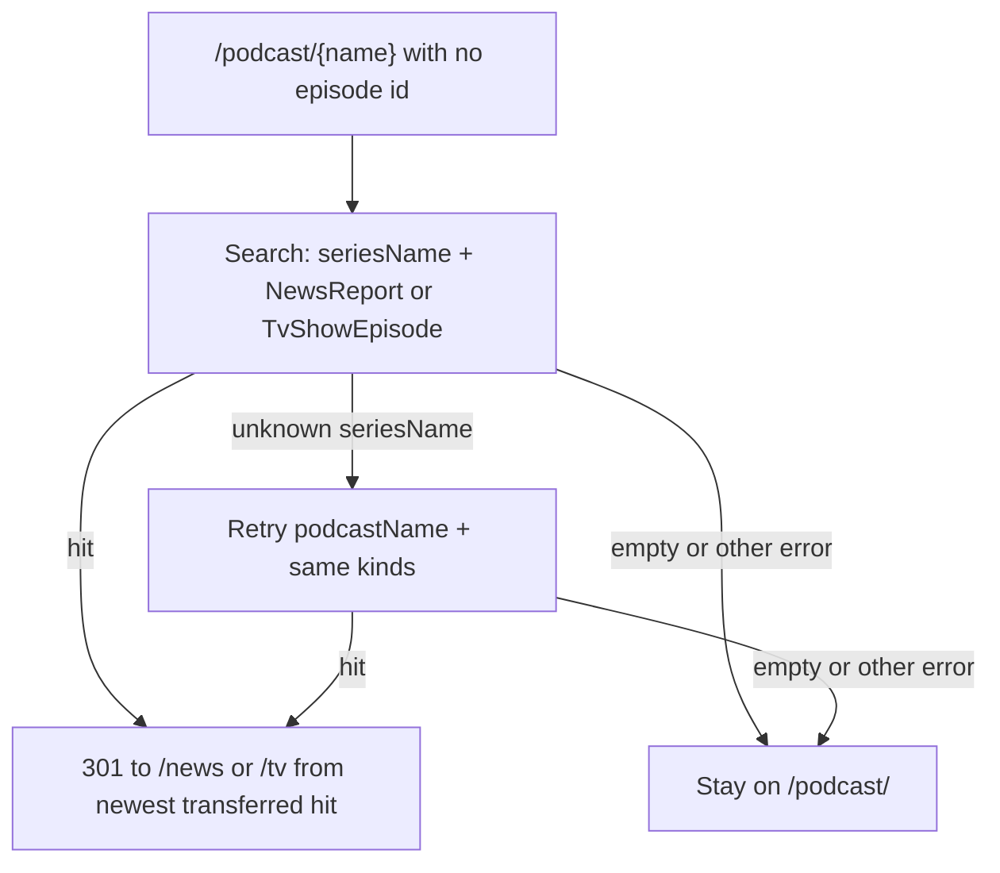

# Series hubs and moved-kind redirects

`/tv/{name}` and `/news/{name}` browse a transferred series the same way `/podcast/{name}` browses episodes: Search `count` in the heading, subject pills, and infinite scroll via `InfiniteScrollStrategy` (`getTake(1)` is 20, then 100) plus `ScrollDispatcher`.

Old `/podcast/{name}` links 301 to a hub only when Search still has **transferred parent kinds** (`NewsReport` or `TvShowEpisode`). Film is not a parent. Remaining `Episode` rows are not a reason to leave the podcast page.

