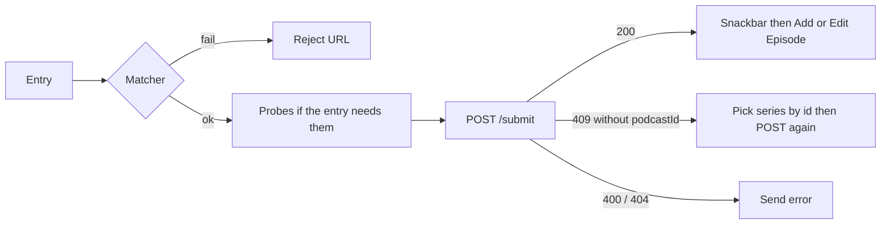
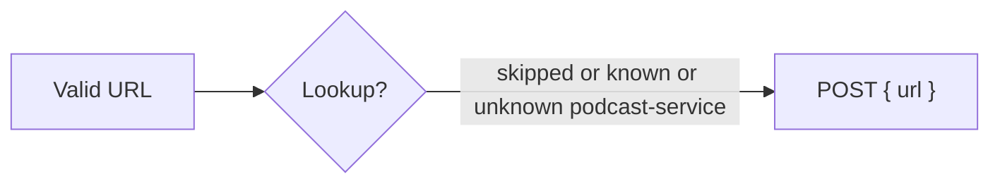
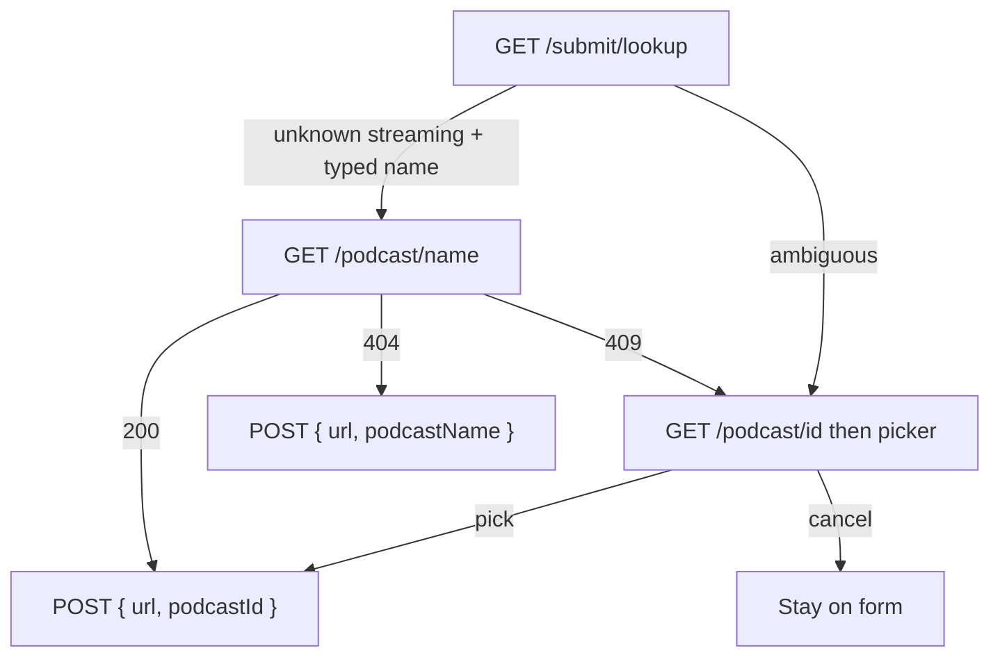
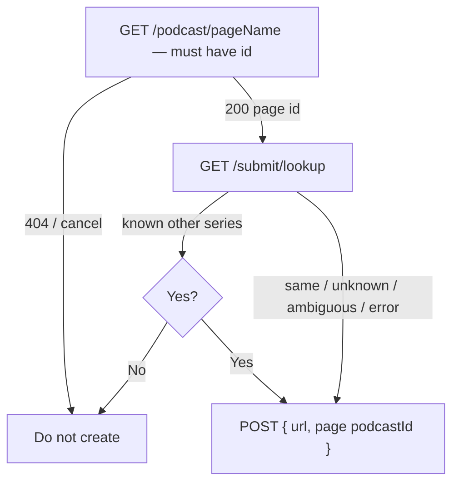
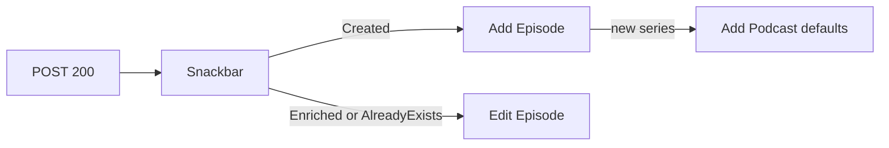
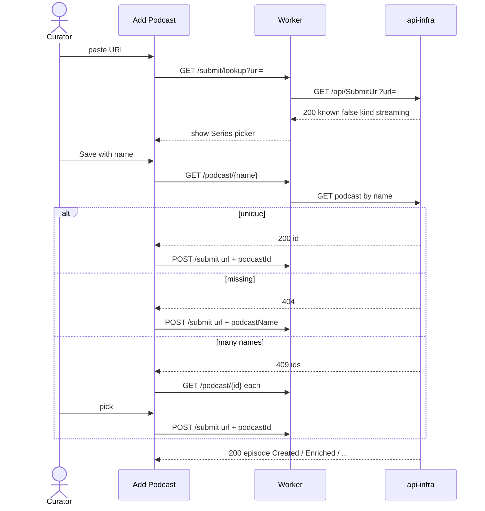
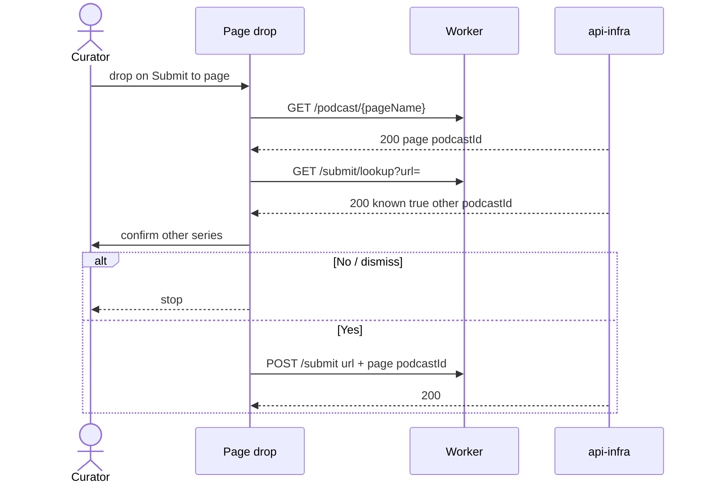

# Submit URL flows

How the client turns an episode URL into `POST /submit`, which Worker/Azure endpoints it calls, and what each response does next.

**Business rules (Vitest):** `src/app/submit-ingest-ux.ts`, `src/app/submit-series.util.ts`, `src/app/submit-series-conflict.ts`.

**Siblings:** RedditPodcastPoster PR submit (`GET`/`POST` Isolated `SubmitUrl`); Api Worker `GET /submit/lookup`, `POST /submit`, `GET /podcast/{name|id}`.

## Purpose

Four ingest surfaces share one command (`POST /submit`) and optional probes. Series attach is the **exception**. The podcast-page overlay stays **two** drop targets; the other-series check is a dialog after drop, not a third zone.

## Endpoints

Client talks to the **Cloudflare Worker** (`environment.api`). The Worker proxies Azure Functions (`api-infra`). Isolated Functions have no Swagger; Worker OpenAPI is the public contract.

| Worker | Azure | Auth | Role |
|--------|--------|------|------|
| `GET /submit/lookup?url=` | `GET /api/SubmitUrl?url=` | `submit` | Read-only membership. No ingest. |
| `POST /submit` | `POST /api/SubmitUrl` | `submit` (optional token) | Command: categorise, attach, or create. |
| `GET /podcast/{name}` | GET podcast by name | `curate` | Unique → id; missing → 404; many → **409** UUID list. |
| `GET /podcast/{id}` | GET podcast by id | `curate` | Catalogue row for conflict pickers. |

Worker **forwards** Azure 400 / 404 / 409 on POST (and lookup 400 / 404). Those are not D1-queued as success.

`POST /submit` body always includes an absolute `http`/`https` `url`. Optional `podcastId` / `podcastName` only when the flow is attach or name-create.

Lookup **200** shapes:

- Known unique: `{ known: true, podcastId, podcastName, kind }`
- Unknown: `{ known: false, kind: "podcast-service" \| "streaming" \| "unrecognised" }`
- Ambiguous: `{ known: false, ambiguous: true, kind, podcastIds }` (**200**, not 409)

Name **409** is a **shared podcast name**, not URL membership. Do not confuse the two.

## Map

Every valid URL is matched locally, then (optionally) probed, then **one** `POST /submit`. Branching is which probes run, not a different command.

Which probes:

| Entry | Lookup | GET podcast by name | GET podcast by id |
| --- | --- | --- | --- |
| General drop / share | no | no | only if POST 409 |
| Add Podcast | yes | if Save needs a name | if lookup or name is ambiguous |
| Submit to this page | after page id | yes — must already exist | no (confirm dialog instead) |

### URL-only (general drop, share, Add Podcast known / unknown podcast-service)

### Add Podcast when Series is in play

### Submit to this page

### After a successful POST

## What each response does

| Call | Response | Next |
| --- | --- | --- |
| **GET `/submit/lookup`** | `known: true` | Add Podcast: URL-only POST, Series read-only. Page drop: if **other** `podcastId` → confirm; if **same** → POST to page. |
| | `known: false`, `kind: podcast-service` | Add Podcast: hide Series, URL-only POST. Page drop: POST to page (no picker). |
| | `known: false`, `kind: streaming` | Add Podcast: Series picker. Page drop: POST to page. |
| | `ambiguous: true` + `podcastIds` | Add Podcast: load ids, picker, then POST with chosen id. Page drop: **ignore picker**, POST to page. |
| | `kind: unrecognised` or 400 | Reject URL. |
| | error / 500 | Add Podcast: fall back to host class (`submitSeriesUiFromLookup`). Page drop: still POST to page. |
| **GET `/podcast/{name}`** | 200 one row | Attach `podcastId`. |
| | 404 | Name-only create (**Add Podcast** only). Page attach treats 404 as error (do not create). |
| | 409 UUID list | Load each id, curator picks. |
| **POST `/submit`** | 200, `episode: Created` | Snackbar **Edit** → **Add Episode** (podcast name frozen). If `podcast: Created` → then **Add Podcast** defaults. |
| | 200, `Enriched` / `EpisodeAlreadyExists` | **Edit Episode**. |
| | 409 UUID list and **no** `podcastId` on the request | Same picker as name conflict, then POST again with `podcastId` + same `url`. |
| | 400 / 404 | Send-dialog error. 404 = missing `podcastId`. |

## Entry points

### Add Podcast (toolbar)

Curator Series field is driven by lookup (`submitSeriesUiFromLookup` / `submitDialogResult`). Public users never see Series.

1. Debounced `GET /submit/lookup` after a valid parsed URL.
2. Save waits until lookup finished for **this** href (`submitLookupReadyForSave`).
3. Known unique → POST `{ url }` only (never leftover `podcastName`).
4. Unknown podcast-service → POST `{ url }` only (platform metadata creates the show).
5. Unknown streaming + typed name → `GET /podcast/{name}` then POST with id or name.
6. Ambiguous lookup → `GET /podcast/{id}` for each id, picker, then POST with chosen id.

### General drop and share

Matcher only. **No lookup required.** Body is `generalDropSeries()`: `{ url }` with no series fields. Overlay copy: *Cult Podcasts will match the podcast automatically.*

### Submit to this podcast (page drop)

Curator, podcast route only. Overlay copy: *Link this episode to the podcast shown on this page.*

1. `GET /podcast/{name}` via `resolveSeriesForAttach` — must already exist (`podcastId` required).
2. `GET /submit/lookup`.
3. `pageDropPlan`: other series → confirm (*This URL is already on {other}. Submit to {page} anyway?*). Only explicit Yes continues.
4. Always POST `{ url, podcastId }` of the **page**. Lookup never replaces the page id. Ambiguous lookup does not open the 409 picker.

Same confirm when the **podcast-page submit dialog** attaches to the page with an empty Series field.

### Add Episode / Edit Episode

Not a submit-URL entry. They open **after** POST from the origin snackbar (`postSubmitEpisodeDialog`). Add Episode does **not** pick a series. Extra service URLs/images belong on that form.

## Sequence: Add Podcast, unknown streaming + typed name

## Sequence: Submit to this page, URL already on another series

## Key files

| Path | Role |
|------|------|
| `src/app/submit-ingest-ux.ts` | General drop body, page-drop plan, post-submit dialog kind |
| `src/app/submit-series.util.ts` | Add Podcast Series UI + Save plan + POST body |
| `src/app/submit-series-conflict.ts` | Name probe, attach, 409 picker, other-series confirm |
| `src/app/submit-url-lookup.service.ts` | `GET /submit/lookup` |
| `src/app/submit-podcast/` | Add Podcast dialog |
| `src/app/send-podcast/` | `POST /submit` + 409 retry |
| `src/app/app.component.ts` | Drop overlay |
| `src/app/podcast-api/` | Page submit dialog attach |
| `src/app/submit-url-origin-response-snackbar/` | Created / Enriched / already exists → episode dialogs |

## Overlay layout

Podcast-page overlay keeps **exactly two** targets (`CHROME-DOCK-DROP`). Do not add a third drop zone for warnings; the other-series check is a **dialog after drop**.
