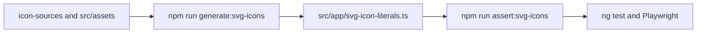

# Streaming icon sources

Prefer **official storefront SVG**. Raster PNG is a last resort when the live
app icon is a photographic / 3D mark with no usable colourful SVG (Disney+
aurora, D+ glossy D, video-host favicon, ITVX apple-touch).

Do not hotlink CDNs at runtime (SSR + CORS). Check files into `icon-sources/`,
then `npm run generate:svg-icons`. Do not hand-edit `svg-icon-literals.ts`.

`npm run test:all` runs `generate:svg-icons --check` first so a stale
`svg-icon-literals.ts` fails CI and pre-push.

## Official SVG tiles

| File | Source |
| --- | --- |
| `channel4-favicon.svg` | `https://www.channel4.com/favicon.svg` (class-based fill inlined) |
| `vimeo-iris.svg` | Vimeo `iris_icon_v_64.svg` on the live apple-touch charcoal |
| `play-suisse-icon.svg` | Play Suisse `ps-icon-with-srg.svg` chevron + plus on the live red tile |
| `hbo-max-logo.svg` | HBO Max brand portal 1-color stacked logo (`HBO_Max_Vert_W_RGB.svg`) |

Sources whose viewBox is already `0 0 24 24` (HBO Max) are clipped in a `<g>`;
other viewBoxes keep a nested `<svg>` so slice mapping stays correct.

Refresh Channel 4 / Vimeo / Play Suisse by re-downloading the storefront SVG,
keeping geometry, then regenerating.

## Official PNG (no colourful SVG)

| File | Source |
| --- | --- |
| `disney-plus-app-icon.png` | Live bamgrid / apple-touch, resized to 96×96 |
| `dplus-app-icon.png` | Live apple-touch, resized to 96×96 |
| `bc-app-icon.png` | Official 128 favicon, resized to 96×96 (filename omits the host) |
| `itvx-app-icon.png` | Live App Store / apple-touch tile, 96×96 |

Disney+ `mask-icon` SVG is a monochrome aurora outline — do not use it for the
episode-link tile. Max publishes no favicon.svg; the episode tile uses the
brand-portal 1-color SVG instead (primary iridescent logos are pixel-based per
their guidelines).

## Simple Icons paths

`paths.json` holds SVG path `d` attributes from [Simple Icons](https://simple-icons.org)
for marks that are already official vector glyphs (Netflix N, Paramount+
mountain). Only keep SI paths that `boxedIcon(...)` still references.

**Max / HBO Max:** do **not** re-add Simple Icons `max`. That glyph is a black
self-boxed rounded square — it disappears on dark episode-link chrome. Product
mark is the official 1-color stacked logo SVG from the brand portal.

## Hand-drawn SVG (matches live apple-touch geometry)

Prime Video (blue + `prime` / `video` + smile), TVNZ+ gradient plus, Play RTS
(`RTS` on `#AF001E`), and Fawesome triangles live in
`generate-svg-icon-literals.mjs`.
